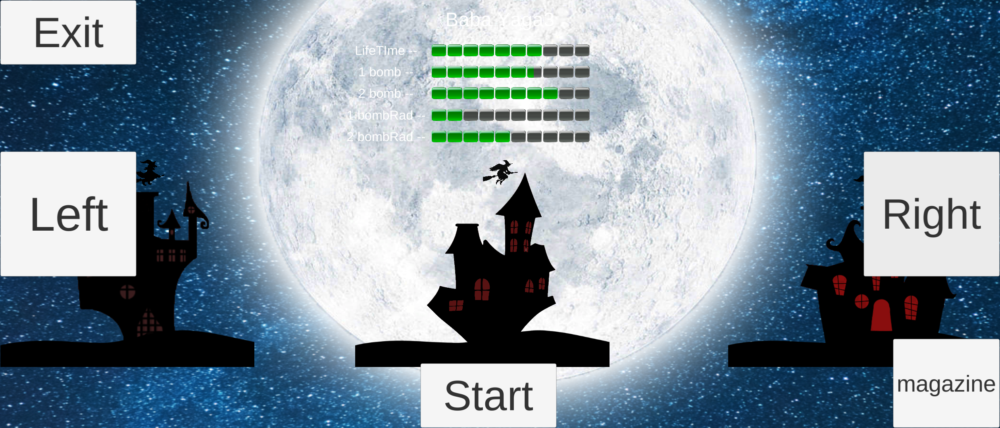
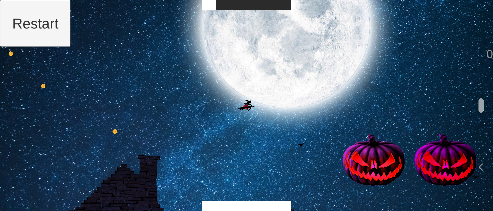
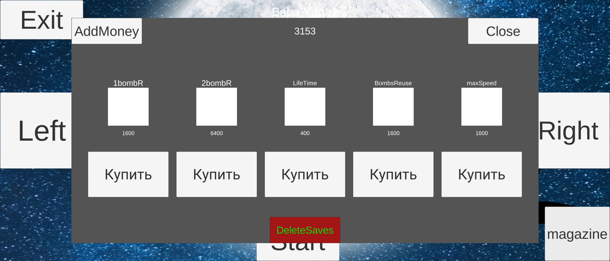
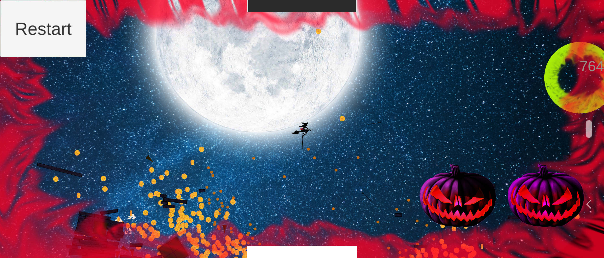

# Project 3
-----
Мобильная игра. В данный момент находится на стадии Альфа-тестирования.
Реализутеся по типу открытого мира, главный герой - ведьма, которая терраризирует город. Сверху находится шкала жизни ведьмы, она постепенно падает. Разрушения прибавляют здоровье ведьме.
# Главный герой
 </html>

Всего в игре 4 ведьмы. Изначально, игроку доступна только первая ведьма. У нее самые низкие показатели такие так скорость, сила бомбочек, живучесть.
Зарабатывая монетки, эти показатели можно улучшать. 

# Миры
Мир № 1

 </html>

В игре будет реализовано 4 мира, где в каждом последующем увеличивается уровень сложности. Чтобы пройти до конца, необходимо "Прокачивать" свою ведьму.

# Система прокачки

 </html>

За заработанные монеты можно улучшить показатели ведьмы такие как: Радиус разлета 1 и 2 бомб, время жизни, перезарядка и скорость полета.

# Игровой процесс

 </html>

Изначально, игрок вылетает из дома с полной шкалой здоровья, которая постепенно начинает падать. Игроку доступны все локации, все предметы можно разрушать.
В игре доступны такие объекты разрушения как: дома, замки, палаточные лагеря, фермы, животные и т.п. В замках есть защитници, которые стреляют по ведьме из лука. За каждое разрушение игрок полувчает монеты и прибавку к здоровью. 
Игра продолжается пока здоровье игрока больше нуля.

# Дальнейшая разработка

К сожалению проект остановился на стадии альфа-тестирования, так как изначально, задумка казалась интересной, но в процессе реализации оказалась довольно скучной. Возможно,
в дальнейшем, получится добавить какую либо изюминку и возобновить проект.

##
Исполнитель - Чирков Андрей Владимирович, группа РИС-19-1бз
